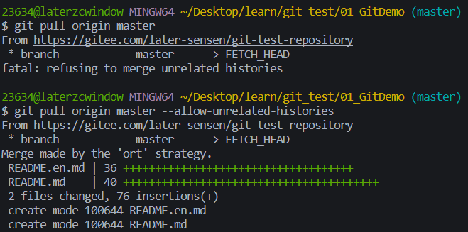

# 解决Git拒绝合并无关历史问题：详解allow-unrelated-histories选项的应用与实际案例

## 前言
自 `Git 2.9` 版本起，Git 在执行 merge 和 pull 操作时，默认不允许合并具有不相关历史的分支。这一变更旨在防止因无意中合并无关的历史而导致的意外后果。
然而，在某些特殊情况下，合并不相关的历史是必要的操作。因此，了解如何处理这一问题对于日常使用和开发维护 Git 仓库至关重要。

## 问题描述
在执行 `git merge` 或 `git pull` 命令时，如果 Git 检测到两个分支的根提交不同，意味着它们的历史不相关，Git 将拒绝合并并抛出如下错误：
```shell
fatal: refusing to merge unrelated histories
```
这种情况通常出现在以下几种场景中： 
> ① 本地仓库与远程仓库的初始化历史不同。
> 
> ② 不同项目或目的的分支尝试合并。
> 
> ③ .git 目录损坏或误操作导致历史记录混乱。 

## 解决方案
### 用户指南
针对一般用户，本文将提供简明易懂的步骤，帮助快速解决“拒绝合并不相关的历史记录”错误。

**步骤1：理解错误原因**  
在尝试合并或拉取远程分支时，Git 检测到两个分支的历史记录没有共同的祖先，这意味着它们是从不同的起点开始的。这种情况可能由于以下原因导致： 
- 本地和远程仓库分别独立初始化，缺乏共同的提交历史。
- 使用不同的初始化方法（如 git init vs git clone）导致历史分叉。

**步骤2：使用--allow-unrelated-histories选项**  
为了允许合并不相关的历史，可以在 git pull 或 git merge 命令中添加 `--allow-unrelated-histories` 选项。

**命令示例：**
```bash
git pull origin master --allow-unrelated-histories
```
**解释：**
- `git pull origin master`：从远程仓库 origin 的 master 分支拉取更新。
- --allow-unrelated-histories：强制允许合并不相关的历史记录。
步骤3：完成合并并处理冲突
执行上述命令后，Git将尝试合并两个不相关的历史。如果存在文件冲突，需手动解决。

示例输出：

bash
复制代码
From https://gitee.com/later-sensen/git-test-repository
* branch            master     -> FETCH_HEAD
  Merge made by the 'ort' strategy.
  README.en.md | 36 ++++++
  README.md    | 40 ++++++
  2 files changed, 76 insertions(+)
  create mode 100644 README.en.md
  create mode 100644 README.md
  解决冲突步骤：

查看冲突文件：

Git会标记有冲突的文件，打开这些文件，查找<<<<<<<, =======, >>>>>>>等标记。

手动编辑文件：

根据需求保留或修改冲突部分的内容，确保文件内容正确。

标记为已解决：

bash
复制代码
git add <冲突文件>
完成合并：

bash
复制代码
git commit


- `git2.9`版本之后出现的东西

  > Git merge 和 pull 的命令将不允许两个不相关历史的分支进行合并，除非指定一allow—unrelated—histories 选项。当两个分支的根提交不一样时，它们会有不相关的历史，比如，当两个分支用于完全不同的目的（如代码和文档）时。在这种情况下，git不悄悄地合并无关历史是可取的，因为这可能会产生意想不到的后果。在一些“特殊”的情况下可能合并无关的历史是必要的，那么可以采用上面提到的一allow-unrelated-histories 选项来强制执行这种行为。

- 以下是一些您可能会遇到致命错误的情况: 拒绝在`Git`中合并不相关的历史错误。
  
  - 您有一个本地存储库，其中包含提交，并尝试从现有的远程存储库提取。由于历史不同，`Git`不知道如何继续。因此会出现错误消息。
  
  - 你的`.git`目录损坏了
  
  - 当你的分支位于不同的`HEAD`位置时
  
  

- 我们可以通过允许不相关的合并来解决这个错误。我们可以通过向`pull`请求添加`——allow-unrelated-histories`标志来做到这一点
- 如下所示

```bash
git pull origin master --allow-unrelated-histories
```

